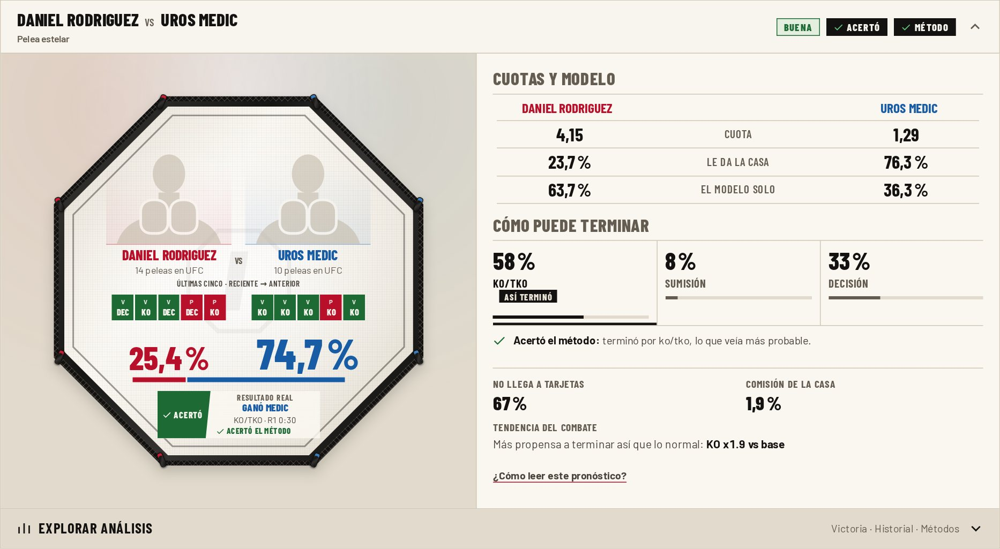
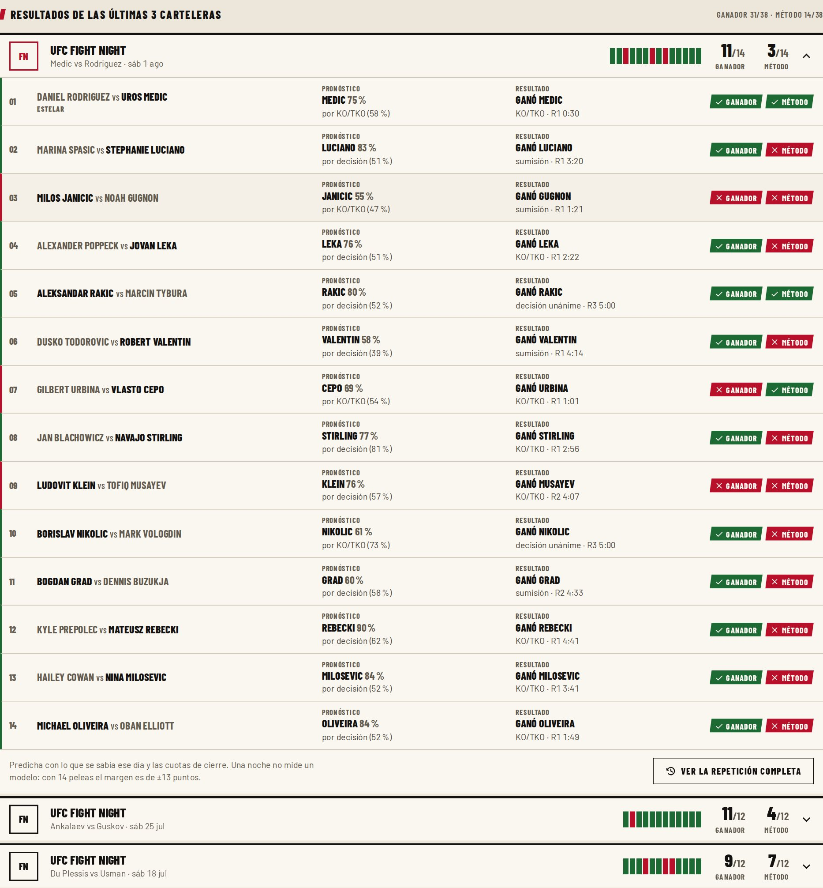
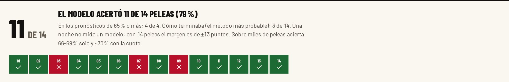
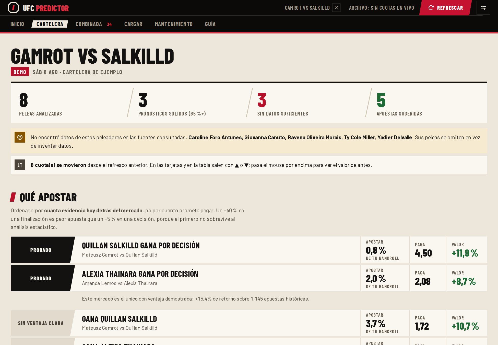
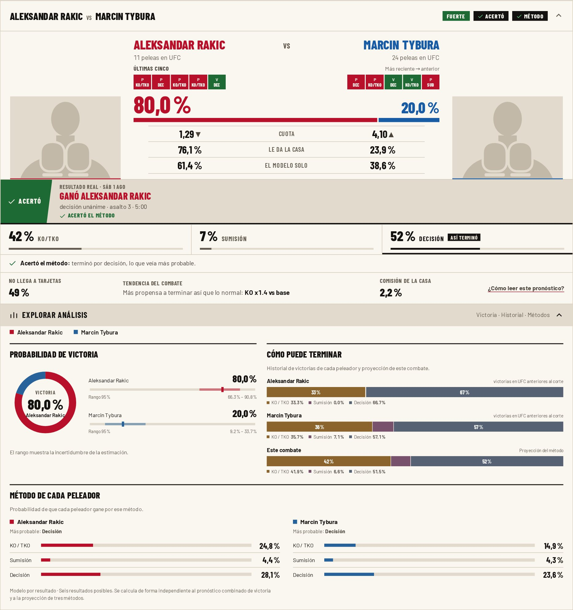
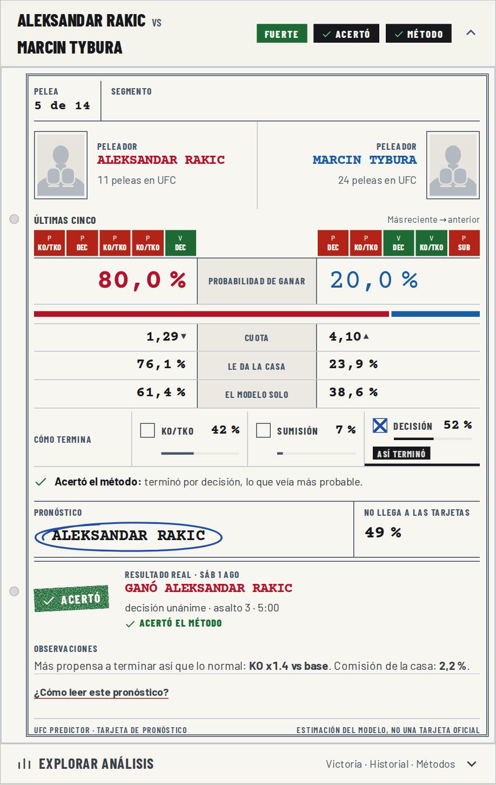
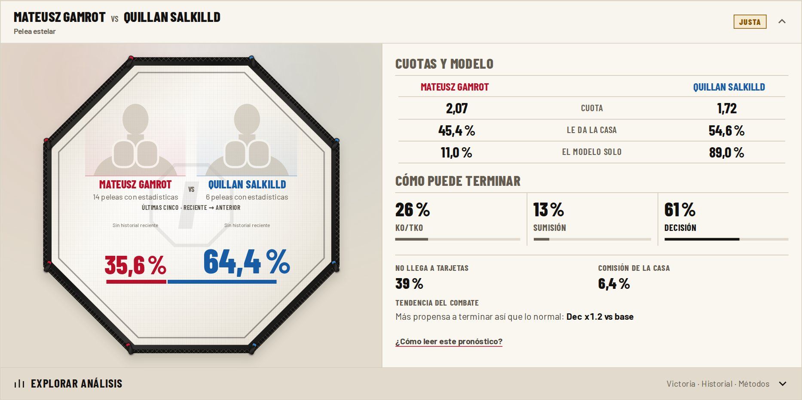
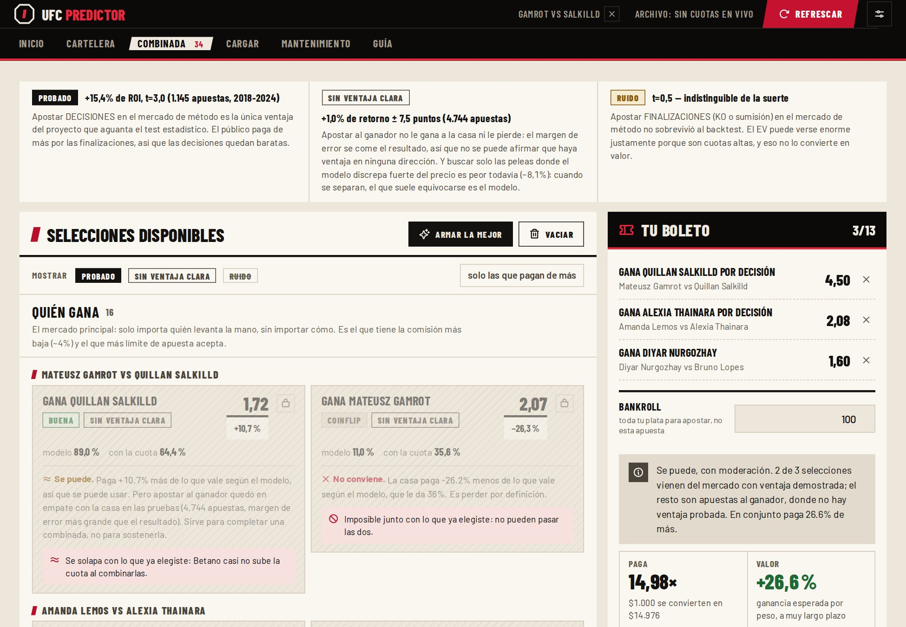
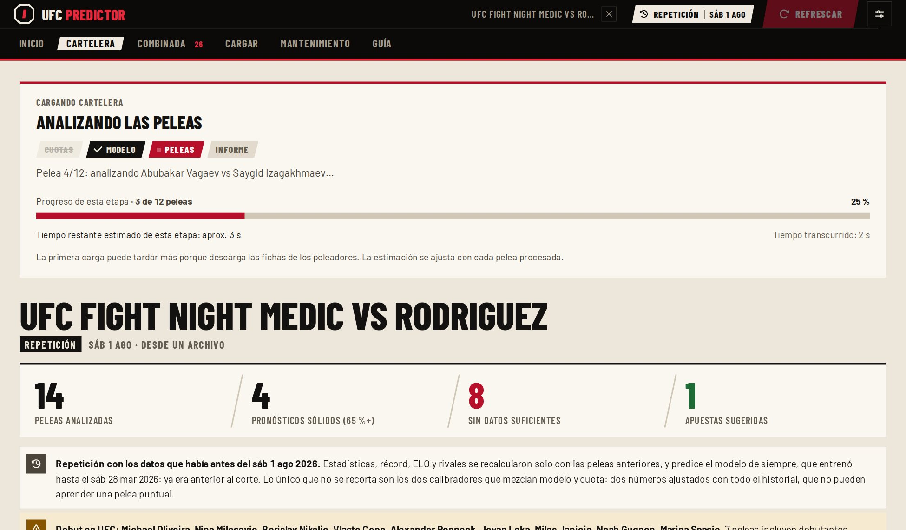
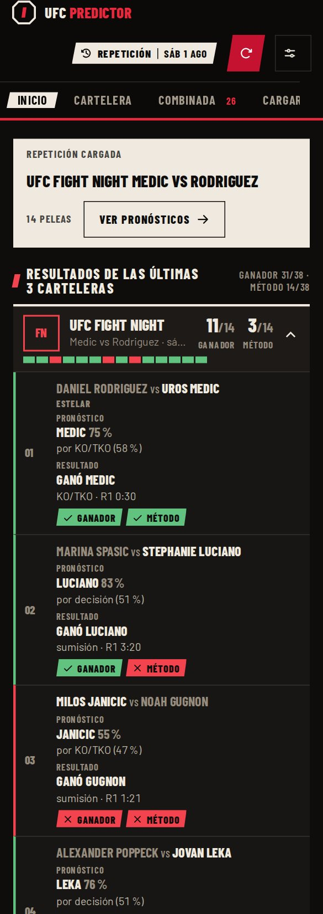

<div align="center">

# 🥊 UFC Fight Predictor

**Scraping propio → features diferenciales → XGBoost → Monte Carlo → reporte**

[](https://www.python.org/)
[](https://xgboost.readthedocs.io/)
[](#-qué-scrapea-y-cómo)
[](#-qué-tan-bien-funciona-y-qué-no)
[](#-interfaz-web)
[](https://github.com/SinLeeke/ufcpredictionmodel/actions/workflows/pruebas.yml)

<br>



<sub>Una repetición real: el modelo predice la estelar del 1 de agosto de 2026 solo con lo que se sabía antes de ese día, y después muestra cómo terminó.</sub>

<br><br>

**[La interfaz](#-la-interfaz-en-capturas)** · **[Los números](#-los-números-primero)** · **[Empezar](#-empezar)** · **[Los datos](#-qué-scrapea-y-cómo)** · **[Cómo predice](#-cómo-predice)** · **[Qué se descartó](#-qué-se-descartó-y-por-qué)** · **[UI web](#-interfaz-web)** · **[Los límites](#-qué-tan-bien-funciona-y-qué-no)** · **[Estructura](#-estructura)** · **[Créditos](#-créditos)**

</div>

> [!WARNING]
> **Proyecto personal de un estudiante universitario**, hecho por curiosidad y por
> diversión. No es un producto y no hay soporte.
>
> Lo que entrega son **estimaciones estadísticas con margen de error**, no certezas — este
> mismo README explica por qué el sistema **no le gana al mercado**. Apostar queda bajo
> responsabilidad de quien lo haga, y nada acá es consejo financiero.

---

## 🖼 La interfaz en capturas

Todo corre en tu PC, en `http://127.0.0.1:8000`, sin cuentas ni servidores externos.
Las capturas son de la aplicación real, con la base local y con la cartelera de demo
que trae el repositorio.

**Inicio: cómo le fue al modelo en las últimas 3 carteleras.** Cada una se abre como un
combate y muestra, pelea por pelea, el pronóstico de ese día contra el resultado, con un
sello para el ganador y otro para el método. Arrancan cerradas; la tira de colores y los
dos marcadores se leen sin abrirlas.



<sub>31 de 38 ganadores en estas tres carteleras es una buena racha, no el acierto del modelo: sobre
miles de peleas fuera de muestra acierta 66-69 %. Con 12-14 peleas por noche el margen es de
±13-15 puntos, y la propia fila lo dice.</sub>

<details>
<summary><b>Más capturas: repetición, cartelera, análisis, tarjeta del juez, combinada, carga y teléfono</b></summary>

<br>

**El marcador de una repetición.** Cuántas acertó, con su margen de error, y una casilla
por pelea que lleva a cada combate.



**Una cartelera con cuotas.** Lo primero es *Qué apostar*, ordenado por cuánta evidencia
respalda cada mercado y no por cuánto promete pagar.



**Una pelea abierta, con el análisis desplegado.** Cuotas contra modelo en espejo, cómo
puede terminar, el resultado real con los dos veredictos y los gráficos de victoria,
historial por método y los seis resultados posibles.



**Estilo «Tarjeta del juez».** La misma información como el acta que llena un juez:
casillas, cifras a máquina, el pronóstico encerrado con lápiz y la confianza como timbre.
Se elige en el botón de opciones, junto con el tema claro u oscuro.



**La estelar en el octágono** (cartelera de demo, antes de pelear).



**El simulador de combinadas.** Cada selección dice si conviene y por qué, bloquea las
incompatibles y mide cuánto error aguanta el boleto completo.



**La carga, etapa por etapa**, con lo que está haciendo y cuánto falta.



**En el teléfono y en tema oscuro.**



</details>

Sin foto verificada del peleador aparece una silueta: en estas capturas no había
conexión para bajar retratos.

---

## 📊 Los números, primero

<div align="center">

| | Acierto | Brier |
|---|:---:|:---:|
| Modelo solo | 66-69 % | 0,211-0,213 |
| Mercado solo (Betano) | ~69 % | 0,197 |
| **Modelo + mercado** | **~70 %** | **0,195** |
| Solo picks de confianza ≥75 % | ~81-86 % | — |

`Acc 0,662` · `AUC 0,718` · `Brier 0,213` — sobre **628 peleas de 2025-2026 fuera de muestra**
(probabilidad simetrizada; reentrenar con los mismos datos mueve estas cifras ~±0,008)

</div>

> [!NOTE]
> Ese techo no es modestia. El mercado de apuestas, con información que este sistema nunca
> va a tener, llega a ~69 %. Si marcara 85 %, sería *leakage*, no talento.

Son resultados de las corridas descritas en este proyecto, no un porcentaje garantizado
para la próxima cartelera. La evaluación está en
[train_model.py](modelado/train_model.py), [evaluar_modelo.py](modelado/evaluar_modelo.py) y
los [backtests de ganador](modelado/backtest_valor.py) y
[método](modelado/backtest_metodo.py). Al cambiar el dataset, el corte temporal o la
configuración, vuelve a ejecutar esas validaciones antes de comparar cifras.

```
   UFCStats            Kaggle             Wikipedia     Sherdog     Betano
  (oficial)      (cuotas históricas)     (reemplazos)  (fuera UFC)  (cuotas)
      │                   │                    │            │          │
      └───────────────────┴──────────┬─────────┴────────────┴──────────┘
                                     ▼
                          features diferenciales
                           (ELO, estilo, forma)
                                     │
                         ┌───────────┴───────────┐
                         ▼                       ▼
                  modelo GANADOR           modelo MÉTODO
                   (XGBoost bin)         (XGBoost 3 clases)
                         │                       │
                         └───────────┬───────────┘
                                     ▼
                         Monte Carlo (10.000 sims)
                                     │
                                     ▼
                     reporte: 4 tablas + HTML por pelea
```

---

## 🚀 Empezar

| Requisito | |
|---|---|
| **Python** | 3.10 o superior; entorno de instalación verificado en Windows con Python 3.12 |
| **Git** | para clonar; también puedes descargar y extraer el ZIP del repositorio |
| **Internet** | para instalar dependencias, descargar datos y cargar retratos por primera vez |
| **Credenciales** | Kaggle si la descarga pide autenticación; alternativa: CSV descargado a mano |
| **Navegador / Selenium** | **no**, ni para el anti-bot de UFCStats ni para Betano |
| **GPU** | no — entrenar tarda segundos en CPU |
| **Disco** | ~60 MB de datos + ~4 MB de modelos, todos regenerables |

### Instalar en Windows

Instala [Python](https://www.python.org/downloads/windows/) con el launcher `py` o con
Python agregado al `PATH`. Para clonar instala [Git](https://git-scm.com/download/win).
Abre PowerShell y ejecuta:

```powershell
git clone https://github.com/SinLeeke/ufcpredictionmodel.git ufc_predictor
cd ufc_predictor
.\scripts\instalar.bat
.\scripts\lanzar_ui.bat --demo
```

El instalador crea `.venv` e instala `requirements.txt` con el Python de ese entorno.
Los paquetes opcionales comentados en el archivo no se instalan. Los lanzadores de
`scripts/` encuentran `.venv` automáticamente, incluso al abrirlos con doble clic;
no necesitas activar el
entorno ni cambiar la política de PowerShell.

Si prefieres hacerlo manualmente, desde la raíz del proyecto:

```powershell
py -3 -m venv .venv
.\.venv\Scripts\python.exe -m pip install --upgrade pip
.\.venv\Scripts\python.exe -m pip install -r requirements.txt
.\.venv\Scripts\python.exe -m webui.server --demo
```

Si no tienes `py` pero `python --version` funciona, reemplaza únicamente el primer
comando por `python -m venv .venv`.

La interfaz abre [http://127.0.0.1:8000](http://127.0.0.1:8000). Deja la terminal abierta
y ciérrala con `Ctrl+C` al terminar. Si el puerto está ocupado, cierra la otra instancia.

### Probar la interfaz antes de construir la base

`--demo` carga una cartelera ya predicha desde `webui/demo/`, incluido en Git. Puedes
explorar las peleas y el simulador de combinadas sin descargar la base ni entrenar
modelos. La demo no actualiza cuotas ni vuelve a predecir. Los retratos se consultan al
cargarse y quedan en caché; si no están disponibles, aparece una silueta.

Un clon nuevo contiene el código, las demos y `cards/ejemplo_con_cuotas.csv`.
**`data/`, `models/` y `outputs/` no se versionan**: los comandos siguientes los generan
en tu equipo. El almacenamiento de datos sigue siendo local, con CSV, JSON y modelos
en archivos `.pkl`.

### Construir la base para predecir carteleras nuevas

La primera descarga puede tardar alrededor de una hora, según la red y los cachés.
Ejecuta estos comandos desde la raíz, usando el mismo entorno de la instalación:

```powershell
.\.venv\Scripts\python.exe -m src.ufcstats_events
.\.venv\Scripts\python.exe -m src.ufcstats_fighters
.\.venv\Scripts\python.exe -m src.ufcstats_fightstats
.\.venv\Scripts\python.exe -m src.reemplazos
.\.venv\Scripts\python.exe -m src.scraper
.\.venv\Scripts\python.exe -m modelado.train_model
```

`src.scraper` descarga el dataset configurado en `config.py` e ingiere features,
peleadores y ELO. Si Kaggle pide autenticación, configura
`C:\Users\<tu-usuario>\.kaggle\kaggle.json`. También puedes descargar `data.csv` del
[dataset público](https://www.kaggle.com/datasets/mdabbert/ultimate-ufc-dataset), renombrarlo
como `kaggle_ufc.csv` y guardarlo en `data\raw\` antes de ejecutar `src.scraper`.
Nunca subas tus credenciales al repositorio.

Los scrapers guardan cachés y retoman las descargas incompletas. Los resultados quedan
en `data/processed/`; el entrenamiento genera `winner_xgb.pkl`, `method_xgb.pkl` y el
modelo de medición `winner_xgb_split.pkl` en `models/`.

Para habilitar la mezcla con el mercado y el análisis calibrado del método, genera sus
modelos una vez y recalcula tras cambiar el entrenamiento:

```powershell
.\.venv\Scripts\python.exe -m modelado.backtest_valor --refit
.\.venv\Scripts\python.exe -m modelado.backtest_metodo --refit
```

Se guardan `calibrador_mercado.pkl`, `calibrador_metodo.pkl` y `metodo6_xgb.pkl`.
Sin los modelos entrenados, la predicción puede recurrir a una heurística; sin
calibradores, avisa y no presenta el análisis como calibrado. Para comprobar los
resultados del modelo usa `.\.venv\Scripts\python.exe -m modelado.evaluar_modelo`.

BestFightOdds se ejecuta aparte con `.\.venv\Scripts\python.exe -m src.bfo_odds` si quieres descargar las
cuotas históricas recientes. No es un requisito del pipeline de entrenamiento actual.
Más detalles de datos y mantenimiento en [MANUAL.md](MANUAL.md).

### Usar la aplicación

```powershell
.\scripts\lanzar_ui.bat
```

Al abrir, **Inicio** muestra cómo le fue al modelo en las últimas 3 carteleras de tu
base (la primera vez tarda unos segundos por cartelera: las predice como repeticiones y
las guarda). En **Cargar**, elige una cartelera de Betano y pulsa **Predecir**, o sube tu CSV.
Para ver qué habría dicho el modelo en una pelea que **ya pasó**, elígela en **Peleas
anteriores** (o pulsa **Repetir** en una cartelera guardada con fecha pasada): se predice
con lo que se sabía antes de ese día y, después, se muestra cómo terminó.
El scraper y el refresco de cuotas usan el dominio chileno
[www.betanosports.com](https://www.betanosports.com/) definido en `config.BETANO_BASE`.
El modo en vivo se activa desde la interfaz.

La consola permite el mismo flujo:

```powershell
.\.venv\Scripts\python.exe -m src.betano_scraper "UFC Fight Night" cards/mi_evento.csv
.\.venv\Scripts\python.exe -m src.card cards/mi_evento.csv
```

Añade `--fecha AAAA-MM-DD` al scraper si una liga contiene eventos de varios días.
Con `--detalle`, `src.card` muestra las tablas completas.

En un CSV manual, `segment` identifica la estelar o coestelar. Para marcar un combate
por el título, añade `es_titulo` (también se acepta `title_bout`) con `true/false`,
`1/0` o `sí/no`. Un valor vacío, desconocido o contradictorio queda sin confirmar.
El dorado se aplica a **cualquier pelea por el título confirmada**, sea estelar,
coestelar u otro combate. La estelar y todos los combates por el título llevan
octágono; una coestelar sin cinturón conserva su tarjeta normal.
Al cargar o actualizar una cartelera, el sistema consulta las fichas oficiales de
eventos de UFC y cruza la pareja de peleadores con la fecha. La etiqueta oficial
«Title Bout» confirma el cinturón; su lugar en la cartelera o durar cinco asaltos
no basta. Una anotación manual explícita tiene prioridad.
El CSV guarda la fuente en `titulo_fuente` y la fecha en `fecha_evento_utc`; también
se reconoce la fecha de archivos `betano_AAAA-MM-DD_…csv`. Sin fecha o confirmación
oficial, el dato queda desconocido. Las consultas usan caché y un fallo de conexión
no impide predecir el evento.
Los datos resueltos llevan `titulo_automatico=true` y se vuelven a comprobar al
actualizar; para imponer una anotación manual sobre ellos, usa
`titulo_automatico=false` junto con `es_titulo`.

---

## 🕸 Qué scrapea y cómo

Siete fuentes para los datos y las cuotas. **Ninguna necesita navegador**: todo con `requests`, caché en disco y
descarga incremental — cada corrida pide solo lo que falta.

| Fuente | Aporta | Al día |
|---|---|:---:|
| **UFCStats** | resultados, stats por pelea y por round, fichas | ✅ mismo día |
| **UFC.com** | confirma qué combates son por el título en la cartelera oficial, por pareja y fecha | ✅ |
| **Kaggle** (`mdabbert`) | cuotas históricas — lo único que UFCStats no publica | ⏳ ~4 meses |
| **BestFightOdds** | descarga cuotas recientes para inspección; no entra en el entrenamiento actual | ✅ |
| **Wikipedia** | quién entró de reemplazo (corto aviso) | ✅ |
| **Sherdog** | carrera fuera de UFC, solo al predecir debutantes | ✅ |
| **Betano** | cuotas de la cartelera que viene | ✅ |

Los retratos de la interfaz tienen un circuito aparte: **perfil UFC verificado → ESPN → UFC → Sherdog →
silueta**. ESPN aporta los PNG transparentes de sus fichas de MMA; no añade datos de
entrenamiento. Las imágenes se guardan en `data/raw/fotos/`, y las entradas de caché
anteriores se revisan para preferir retratos verificados sin borrar las fotos locales existentes.
Las imágenes editoriales de Wikipedia y los iconos de los sitios no se usan en las tarjetas.

<details>
<summary><b>🔧 Los tres problemas que costó resolver</b></summary>

<br>

> **El anti-bot de UFCStats**

El sitio sirve un *challenge* de proof-of-work SHA256 ("Checking your browser…").
`src/ufcstats.py` lo resuelve en Python: busca el nonce y el target de N ceros, itera
hasta dar con el hash que cumple y hace POST a `/__c` para obtener la cookie. Sin
navegador, sin Selenium.

> **Ian Garry no aparecía**

UFCStats lo indexa como *"Ian Machado Garry"*, bajo la **M**: buscarlo por la inicial de
"Garry" nunca iba a funcionar. Se resolvió usando el buscador propio del sitio en vez del
listado alfabético. Lo mismo con los **dos "Mike Davis"** — ante varios match exactos gana
el de ficha más completa, desempatando por altura, alcance y récord sin abrir cada perfil.

Los cruces por nombre entre fuentes causaron los dos bugs más caros del proyecto, así que
cualquier cruce nuevo exige match exacto y un desempate explícito.

> **Betano mezcla eventos y cambia de formato**

Agrupa *todas* las "UFC Fight Night" bajo un mismo ID de liga, así que una página puede
traer dos carteleras de fines de semana distintos; el scraper las separa por fecha.

Su mercado de método viene en dos formatos y **ambos se capturan**:

| Formato | Qué ofrece | Qué se guarda |
|---|---|---|
| **7 vías** | KO/TKO, sumisión y decisión separados por peleador | las 6 columnas |
| **5 vías** | KO+sumisión combinados + decisión, por peleador | `odds_*_fin` y `odds_*_dec` |

En el de 5 vías no existe un número real de "solo KO", así que `odds_*_ko` y `odds_*_sub`
quedan **vacías** en vez de repartir un valor inventado. Lo que sí existe es el precio de
"gana por finalización", y ese sí se guarda: descartarlo dejaba esas peleas sin ninguna
opción de método analizable.

</details>

---

## 🧠 Cómo predice

En un deporte 1v1 el modelo no ve stats absolutos sino la **diferencia** entre los dos
peleadores (`X_A − X_B`). Cada pelea genera dos filas espejo (A-vs-B y B-vs-A): duplica el
dataset, fuerza una frontera antisimétrica y elimina el sesgo de "esquina roja gana más".

| Bloque | Qué mide |
|---|---|
| **Físico y momentum** | edad, alcance, altura, racha, días desde la última pelea |
| **Nivel** | ELO por categoría de peso, con la victoria **graduada** según cómo se ganó |
| **Matchup de estilo** | golpeo de A amortiguado por la defensa de B, derribos vs defensa de derribo, control, knockdowns, ground share |
| **Calidad de oposición** | ELO de los últimos 5 rivales, mejor rival vencido, veces finalizado, momentum ponderado por antigüedad |
| **Corto aviso** | +1 si solo A entró de reemplazo, −1 si solo B |

Son **23 features** para el modelo de ganador y **16** para el de método. El entrenamiento
usa una ventana de **5 años**: el MMA cambia y las peleas viejas meten patrones que ya no
aplican. Validado en 5 períodos por dos métricas, la ventana corta le gana a usar todo el
historial en **4 de 5** (+0,0117 de AUC y +0,0096 de accuracy). Se controla con
`TRAIN_WINDOW_YEARS` en `config.py`.

<details>
<summary><b>📐 ELO graduado — y por qué se verificó una idea de 2019</b></summary>

<br>

Una victoria por decisión **dividida** vale 0,55 (casi un empate: los jueces ni se
pusieron de acuerdo), mayoritaria 0,61, unánime 0,91, finalización 1,00. La idea viene de
[FightMatrix](https://www.fightmatrix.com/2019/09/18/tuning-glicko-what-i-learned-confirmed/),
que ajustó un Glicko sobre 10 años de peleas.

Como esa calibración es de 2019, se verificó contra datos hasta 2026 con un test directo:
tras ganar de cada forma, ¿cómo le va al peleador en su **siguiente** pelea?

| Ganó por | n | Gana la siguiente |
|---|---:|:---:|
| **S-DEC** | 775 | **46,8 % ± 3,5** |
| U-DEC | 2.970 | 52,7 % ± 1,8 |
| KO/TKO | 2.730 | 52,3 % ± 1,9 |
| SUB | 1.619 | 52,9 % ± 2,4 |

Lo que sostiene el ajuste **sigue vigente**: la decisión dividida predice ~6 puntos menos
de éxito futuro y los intervalos no se solapan. Lo que **no** se replica es la jerarquía
fina entre unánime y finalización: en los datos del proyecto son indistinguibles. Los
valores originales se dejaron igual — corregir décimas que caen dentro del margen de error
es justo el sobreajuste que este proyecto evita.

Medido, el cambio aportó **+0,0026 de AUC, mejor en 7 de 8 semillas**. Modesto, pero
principiado y gratis.

</details>

<details>
<summary><b>🎯 Calidad de oposición — la feature que más aportó</b></summary>

<br>

El modelo veía la racha cruda y el ELO, pero 5 victorias contra rivales flojos pesaban
igual que 5 contra contendientes. El caso que lo delató: Topuria vs Oliveira daba **51,6 %**
—una moneda al aire— cuando Topuria era favorito claro.

`src/oposicion.py` mira las últimas 5 peleas **anteriores a la fecha** y saca 6 features
diferenciales: ELO de los rivales, mejor rival al que le ganó, cuántas veces influyó en un
KO o una sumisión, cuántas veces lo finalizaron a él, y un momentum ponderado por calidad
del rival y por antigüedad (vida media 540 días).

| Modelo | Métrica | Base | +oposición |
|---|---|:---:|:---:|
| Ganador | AUC | 0,7038 | **0,7139** |
| Ganador | Brier | 0,2216 | **0,2165** |
| Ganador | Accuracy | 0,6599 | 0,6581 |
| Método | AUC KO-vs-sub | 0,7523 | 0,7485 (peor) |

Mejor en **las 5 semillas** para AUC y Brier. La accuracy no se mueve —las peleas parejas
siguen parejas— pero mejora la **calidad de la probabilidad**, que es justo lo que alimenta
el cálculo de valor. Con las features nuevas, Topuria vs Oliveira pasó a 63,4 %.

La ablación muestra dónde está el valor de verdad: **en contra quién**, no en la racha.
`opp_elo_max_diff` aporta 6,0 % del gain y `opp_elo_diff` 4,8 %; el momentum por sí solo
apenas +0,0016. Las 6 juntas suman **27,1 % del gain total** del modelo.

</details>

<details>
<summary><b>🔄 Corto aviso — un efecto grande que casi no mueve el modelo</b></summary>

<br>

Quien acepta una pelea con poco aviso no hace campamento completo. El efecto existe y es
grande: **los reemplazos ganan 273 de 691 = 39,5 % ± 3,6**, contra un 50 % de base.

Y aun así el aporte al modelo es modesto, porque solo el **8,6 %** de las filas tienen
reemplazo. Validado en 4 períodos:

| | Base | +corto aviso |
|---|:---:|:---:|
| AUC global | 0,6774 | 0,6783 |
| Accuracy (solo peleas con reemplazo) | 0,6637 | 0,6654 — mixto |
| **Brier (solo peleas con reemplazo)** | 0,2148 | **0,2111 — mejor en los 4** |

**No cambia a quién elige; calibra mejor la probabilidad.** Se quedó porque la consistencia
4/4 en Brier es evidencia entre épocas, no entre semillas, y el Brier es lo que alimenta el
cálculo de valor.

Solo lo usa el modelo de **ganador**: si alguien entra de reemplazo cambia *si* gana, no
*cómo* termina la pelea.

</details>

<details>
<summary><b>🔒 Anti-leakage — lo más fácil de arruinar</b></summary>

<br>

- El **ELO** se construye en un solo pase cronológico, siempre con el rating *pre-pelea*.
  Usar el final en filas históricas infla el AUC a **0,93** (pasó de verdad).
- Calidad de oposición y control usan `bisect`/`searchsorted` con `<` estricto: para una
  pelea de 2019 solo entran peleas **estrictamente anteriores**, ni siquiera las del mismo
  día.
- El split es **temporal**, nunca aleatorio. Uno aleatorio pondría una fila y su espejo en
  lados distintos, o sea la misma pelea en train y test.
- `backtest_carteleras.py` reconstruye a cada peleador **tal como estaba el día del
  evento**, no como está hoy. Sin eso el backtest daba 92 % falso.
- Y aun así tenía **tres fugas más**, encontradas en la revisión de septiembre 2026. Daba
  76-78 % de acierto en 203 peleas donde el modelo, fuera de muestra, acierta 67 %:
  1. **UFCStats pone al ganador primero** (en el 100 % de las peleas) y la probabilidad
     salía orientada a él, así que cualquier sesgo hacia la columna A empujaba hacia el
     resultado real. Ahora A es la esquina roja cuando se conoce, y si no, el orden alfabético.
  2. **Usaba la tabla de ELO final**, que para un evento anterior al corte de Kaggle ya
     incluye esa pelea: el ganador tenía más ELO el 72 % de las veces, contra 58 % con el
     ELO pre-pelea. Ahora se reconstruye a la fecha.
  3. **Evaluaba con el modelo de producción**, que ya había entrenado con esas peleas.
     Ahora usa el de medición, y lo que ninguno de los dos vio queda fuera.

  Corregido: modelo **69 %**, mercado **72 %**, mezcla **71 %** en 208 peleas con cuota.

</details>

<details>
<summary><b>🎲 Dos modelos, Monte Carlo y la mezcla con el mercado</b></summary>

<br>

**Dos modelos, no uno.** El de ganador es binario; el de método es de 3 clases
(KO/Sub/Dec) y usa menos features a propósito (16 vs 23). La predicción de método se
**simetriza** promediando con la pelea espejo: "termina por KO" es una propiedad de la
pelea, no depende de a quién se puso en la columna A del CSV. Sin eso, **el 25,8 % de las
peleas cambiaba el método predicho con solo dar vuelta el orden del archivo**.

La señal del modelo de método es buena y conviene no confundirla con su presentación:

| Pregunta | AUC |
|---|:---:|
| ¿Termina antes del límite? | 0,635 |
| Dado que finaliza, ¿KO o sumisión? | **0,753** |

**Monte Carlo.** 10.000 simulaciones que no repiten la `p` de XGBoost: muestrean
`p_i ~ Beta(α, β)` centrada en `p` para propagar la **incertidumbre** del modelo. De ahí
sale un intervalo creíble en vez de un número puntual frágil. Los valores puntuales que se
muestran son los **exactos**: antes se reportaba la frecuencia de los sorteos, que solo
recupera la `p` con ruido (hasta 0,9 pts), y ese ruido llegaba al EV de las combinadas.

**Mezcla con el mercado.** Si el CSV trae cuotas, la probabilidad que manda es la calibrada:

| | Acierto | Brier |
|---|:---:|:---:|
| Modelo solo | 67,2 % | 0,2143 |
| Mercado solo | 69,4 % | 0,1968 |
| **Mezcla** | **70,3 %** | **0,1950** |

Honestidad obligatoria: **casi todo el mérito es del mercado**. Los pesos ajustados son
mercado ~1,06 y modelo ~0,20 — el modelo aporta información real y estadísticamente
significativa (coeficiente +0,17 con t=3,1), pero vale como un quinto de lo que vale la
línea.

</details>

---

## 🚮 Qué se descartó, y por qué

Esta sección es la más importante del proyecto. La regla es **nada entra sin medirse**, y
el estándar es alto porque el proyecto ya se engañó varias veces solo:

> [!IMPORTANT]
> **Validar en 4-7 períodos temporales distintos, no en uno.** Varias semillas sobre el
> *mismo* test miden consistencia entre semillas, no entre épocas.
>
> **Cuidado con las comparaciones múltiples.** Probar 5 variantes y quedarse con la mejor
> hace que un "4 de 4" sea esperable por azar (28 % de probabilidad).
>
> **Si un backtest da un número espectacular, el bug está en los datos.** Test barato:
> apostar a todas las opciones a la vez debe dar ≈ −comisión.

<details>
<summary><b>📉 Métricas por pelea que se scrapean y no aportan</b></summary>

<br>

De las 22 métricas por pelea de `ufcstats_fight_stats.csv`, el modelo usa 7. Las otras se
probaron como features diferenciales leak-free y se midieron en 4 períodos (accuracy,
3 semillas):

| Grupo | Gana en | Efecto |
|---|:---:|:---:|
| Ubicación del golpe (cabeza / cuerpo / pierna) | 2/4 | +0,0009 |
| Posición (distancia / clinch) | 1/4 | **−0,0031** |
| Intentos de sumisión (`sub_att`) | 3/4 | +0,0009 |
| Reversiones (`rev`) | 4/4 | +0,0027 |
| Las 7 juntas | 1/4 | +0,0010 |

**Ninguna entró.** Reversiones dio 4/4 y estuvo a punto de implementarse, pero su
correlación con ganar es **0,0068** (cero), solo ocurren en el 11 % de las peleas y —lo
decisivo— **se probaron 5 grupos**: la probabilidad de que al menos uno dé 4/4 por puro
azar es del **28 %**.

Esa es la trampa de las comparaciones múltiples: un 4/4 impresiona si se predecía antes de
mirar, no si se eligió el mejor de cinco. Que las 7 juntas den 1/4 mientras una sola da 4/4
confirma el diagnóstico: es ruido.

</details>

<details>
<summary><b>⏱ Datos por round: se bajan, pero no entran al modelo</b></summary>

<br>

UFCStats publica el desglose asalto por asalto y el scraper lo captura (`r1_sig`,
`r2_sig`…). La hipótesis era que el **desgaste** predice: en Rakic vs Tybura los golpes
significativos de Rakic van 36 / 18 / 17 — el total (71) dice "domina", el detalle dice
"domina un round y se apaga".

Se construyeron features de caída de ritmo (82 % de cobertura) y se midieron:

| | Gana en | Media |
|---|:---:|:---:|
| Predecir el ganador (accuracy) | 4/7 | +0,0010 |
| Predecir el ganador (AUC) | 5/7 | +0,0030 |
| Predecir si llega a tarjetas | 3/5 | +0,0015 |

**No entraron.** Con 4 períodos daban 3/4 y parecían prometedoras; al extender a 7 se
cayeron — el mismo patrón que ya había engañado antes. La explicación más probable es que
el desgaste **ya está** en los datos: un peleador que se apaga pierde más, y eso se refleja
en su récord, su ELO y sus tasas de finalización.

Los datos se siguen bajando igual: no cuestan nada y son el insumo para modelar el **round
exacto** de finalización, un mercado que este proyecto no toca todavía.

</details>

<details>
<summary><b>🧪 Ideas de modelado probadas y revertidas</b></summary>

<br>

| Idea | Resultado medido | Veredicto |
|---|---|---|
| **Calibración post-hoc** (Platt / isotónica, ajustando con 2024) | Brier 0,2167 → 0,2181 (Platt) / 0,2178 (isotónica); log loss peor en las dos | XGBoost ya sale calibrado acá. **Empeora** |
| **Flag de 5 asaltos** (estelar = 1ª pelea del evento, 1.182 filas) | Acc +0,0003, AUC −0,0007 (ruido ±0,0037) | Cero. El ELO ya lo capta indirecto |
| **Ensemble de 10 semillas** | Acc 0,6570 → 0,6576, AUC +0,0014 | No sube el acierto; solo quita la lotería de semilla |
| **Arquetipos de estilo** (features simétricas de nivel y de choque) | 4 períodos: +0,0049 / ±0 / **−0,0057** / +0,0023. Media **+0,0004** | Empate. Los diferenciales ya capturan el matchup |
| **Revanchas / head-to-head** ("le tiene el número") | el que ganó antes gana la revancha **115/217 = 53,0 % ± 6,7**, y las revanchas son el 2,5 % de las peleas | El efecto no existe |
| **Glicko-2** en vez de ELO | no implementado: FightMatrix lo probó y reportó que la *rating deviation* aporta poco en MMA | No vale la complejidad |
| **Balancear las clases del modelo de método** | log loss 1,033 vs 0,950 sin balancear; anunciaba **el doble** de sumisiones de las que ocurren (32,0 % contra 16,4 % real) | Revertido. Era peor que no tener modelo |
| **Subir a 12 los rivales de la calidad de oposición** | ganaba en **7 de 8 semillas** sobre el test… y perdía **2 de 3** al validar en otros períodos | Revertido a 5 |
| **Tapar el hueco de 4 meses de Kaggle** con filas armadas desde UFCStats + BestFightOdds (150 peleas, 82 % con cuota) | 4 cortes: acc +0,0044 / +0,0127 / +0,0094 / **−0,0588**. **El AUC no mejora en ninguno.** Media: acc −0,0081, AUC −0,0039 | No entra. Son el 2-5 % de una ventana de 5 años |
| **Poner `NaN` en vez de `0`** en los stats de peleadores sin datos | la premisa era falsa: las peleas con alguien de pocos datos se aciertan **71 %** y las de datos completos **58 %** (140 peleas) | El cero funciona como proxy de "no probado" |
| **`lost_by_finish_rate` real al entrenar** (Kaggle no lo trae y se pone 0,35 a todos; al predecir se usa el real) | walk-forward 2021-2026: ganador mejor en 3/6 (log loss) y 2/6 (Brier); método 2/6. Gana en 2025-26, pierde en 2021-24 | No entra: mixto |
| **Y al revés: 0,35 también al predecir**, para que calce con el entrenamiento | ganador neutro (2/4 semestres); método **peor** (log loss +0,004 y +0,007, 2/4) | No entra: el dato real, aunque fuera de rango, predice mejor el método |
| **Ventana de 5 años en el modelo de 6 vías** (Kaggle cambió de escala en 2019: golpes por pelea → por minuto) | log loss del modelo mejor en 5/6 (−0,0144)… pero el ROI de las decisiones 2018-2024 baja de **+15,4 % (t=3,0) a +7,0 % (t=1,3)** y pierde 8 de 9 años | Revertido: en ese mercado manda el ROI |
| **Intercepto en el calibrador** ("la esquina roja gana más de lo que dice el mercado") | el efecto existe (6/6 años, +0,9 a +5,3 pts), pero aun si A fuera siempre la roja el intercepto mejora el log loss solo 3/6; con orientación incierta, sacarlo gana 6/6 | Fuera: nada garantiza que la columna A del CSV sea la roja |

**El balanceo del método y el N=12 son los que más enseñaron** — y la ventana del modelo
de 6 vías agregó una lección más: **mejor log loss no es mejor apuesta.** El modelo mejoraba
en 5 de 6 años y la apuesta que lo justifica empeoraba en 8 de 9. Hay que medir la métrica
que se usa para decidir, no la que es más cómoda de calcular.

El modelo de método **balanceado** tenía accuracy 0,488 y parecía "solo un poco peor". Lo
que delató el bug fue comparar su log loss contra el de **cantar las tasas base** (1,008):
el modelo era literalmente peor que no tener modelo, y perdía contra la tasa base en los
5 cortes temporales probados. Ese baseline ahora se imprime siempre en `train_model.py`.

El **N=12** pasó 7 de 8 semillas y se implementó. Pero 8 semillas son 8 corridas sobre *el
mismo período de test*: miden consistencia entre semillas, no entre épocas. Al validar en
períodos que no se habían usado para elegir N, ganó 1 de 3 y se revirtió. Desde entonces
todo se valida en varios períodos, que es por qué las tablas de esta sección dicen "4/4" o
"3/7" y no "p < 0,05".

</details>

<details>
<summary><b>✅ Lo que entró en la revisión de septiembre 2026 (y su medición)</b></summary>

<br>

| Cambio | Por qué | Medido |
|---|---|---|
| **Probabilidad de ganador simetrizada** (promedio con la pelea espejo) | dar vuelta A y B en el CSV movía la p 3,8 pts de media (máx 8,7) y cambiaba el pick en 2 de 25 peleas reales | log loss mejor en 5/6 años que la orientación del dataset; empata con la invertida |
| **Mercado de 6 y 5 vías simetrizado** | el calibrador de método ya se ajustaba así; al predecir no | log loss 5/6 |
| **Calibrador sin intercepto** | ver "Intercepto en el calibrador" arriba | 6/6 con orientación incierta |
| **Walk-forward del calibrador de ganador con la ventana de 5 años** | entrenaba con todo; producción usa 5 años | log loss 4/6, AUC 4/6; la estrategia calibrada sigue en empate técnico |
| **ELO de la división de la última pelea** | se tomaba la primera fila del nombre, cuyo orden no depende del peleador (Volkanovski salía con su ELO de peso ligero, 1498, en vez del de pluma, 1655) | acierto +1,7 pts en 4/4 semestres; log loss neutro (2/4). Entra por corrección |

Además se arreglaron bugs que no tocaban el modelo pero sí lo que se predecía: el
método del historial se leía de toda la fila (cualquier rival o evento con "ko" en el
nombre convertía una decisión en KO: el 23 % de los peleadores activos tenía las tasas
de finalización mal), el mercado de 5 vías perdía siempre la cuota de finalización, y el
modo EN VIVO actualizaba la cuota pero no la probabilidad que se muestra ni la de las
combinadas. El detalle está en el historial de git.

</details>

<details>
<summary><b>🚫 Features que existen pero un modelo excluye a propósito</b></summary>

<br>

**`market_edge`** está en `features.csv` y **ningún modelo la usa**. Si el modelo viera la
cuota, copiaría al mercado y nunca discreparía — y el punto es que aporte información
propia. El mercado se mezcla después, en `value.py`, donde se puede medir cuánto pone cada
uno. Es la misma decisión que tomó [MMA-AI](https://github.com/DanMcInerney/mma-ai) por su
cuenta: incluir las cuotas sube la métrica pero baja el ROI.

**El modelo de método** excluye las 6 features de calidad de oposición y la de corto aviso
(usa 16 contra las 23 del ganador). Medido: le empeoran la discriminación KO-vs-sumisión.
Tiene sentido — cómo termina una pelea depende del estilo de los dos, no de contra quién
pelearon antes ni de si uno entró de reemplazo.

> [!CAUTION]
> Olvidar `con_oposicion=False, con_corto=False` al llamar al modelo de método lo hace
> reventar con `feature_names mismatch`. Ya pasó.

</details>

<details>
<summary><b>📭 Datos disponibles que no se bajan</b></summary>

<br>

- **Formato de asaltos (3 vs 5).** UFCStats lo publica (`Time format: 3 Rnd (5-5-5)`). Se
  probó una aproximación derivada de la posición en la cartelera: Acc +0,0003, AUC −0,0007.
  Cero. El ELO ya lo capta indirecto, porque los estelares los pelean peleadores de ELO alto.
- **Días exactos de aviso** en los reemplazos: Wikipedia solo lo dice en el **6 %** de los
  casos, así que se usa un flag binario en vez de un número poco fiable.
- **El historial de Sherdog en el entrenamiento.** Se baja y se usa al predecir, pero
  meterlo al dataset de entrenamiento no mejoró: la calidad del dato no es comparable (una
  victoria regional no equivale a una en UFC) y no trae estadística fina.

</details>

<details>
<summary><b>💸 Mercados que se pueden predecir pero no validar</b></summary>

<br>

Golpes over/under, round exacto, total de rondas. Hay señal: para los golpes significativos
combinados el AUC es **0,645-0,651** en las líneas 50+/75+/100+/125+, comparable al modelo
de ganador.

**No se cubren igual**, porque las únicas cuotas históricas del proyecto son moneyline y
método: **cero cuotas históricas de golpes, rondas o asalto exacto**. Sin ellas no hay forma
de saber si ese 0,65 de AUC le gana al precio, y las casas cotizan bien los totales.

El caso de **"¿llega a tarjetas?"** muestra por qué esto importa. El sesgo es real y grande:
el mercado dice 44,1 % (sin comisión) y ocurre **50,2 %** — 6 puntos, estables en todo el
rango de precio y en todos los tramos. Y aun así **pierde**: cobrar ese sesgo dutcheando las
dos patas de decisión cuesta 10 puntos de comisión, ROI real **−6,1 % (t = −3,1)**.

Un mercado dedicado de 2 vías cobra ~5 % en vez de 22 % y ahí sí saldría, pero eso es
álgebra, no un resultado: no existe una sola cuota histórica de ese mercado para probarlo.
El camino honesto es empezar a registrarlas ahora y validar en unos meses.

> [!NOTE]
> **Nota metodológica.** Al calcular "apostar a que NO llega" salía +12,6 %. Era falso: el
> precio del "No" estaba construido como complemento sin comisión, o sea un precio que
> ninguna casa ofrece. Toda pata sintética tiene que pagar su propio vig.

</details>

---

## 🖥 Interfaz web

`scripts\lanzar_ui.bat` levanta un servidor local (`127.0.0.1:8000`, sin exponer a la red).
Hace lo mismo que la consola sin escribir comandos, y **no re-implementa nada**: la
predicción la sigue haciendo la misma `card.predict_card()` del CLI, que ahora además
devuelve sus estructuras en vez de imprimirlas y descartarlas.

| | |
|---|---|
| **Resultados recientes** | arriba de Inicio, las 3 últimas carteleras de la base predichas como repetición (solo con lo anterior a cada fecha) y comparadas con cómo terminaron. Cada una es un plegable: cerrada, una tira de colores pelea por pelea y los marcadores de ganador y método; abierta, el pronóstico y el resultado de cada pelea con dos sellos. Se calculan en segundo plano la primera vez, quedan en `data/processed/resultados_recientes.json` y se rehacen solas al cambiar la base o el modelo. Arrancan cerradas y se recuerda cuál dejaste abierta |
| **Inicio** | la portada, con la estructura de un sitio de liga: noticias de UFC Español al centro (nota de portada, destacadas y titulares por día), las próximas peleas confirmadas por UFC con su cuenta regresiva a la cartelera estelar o a las preliminares, y los eventos: próximos (con **Predecir**, sin cuotas), terminados y los últimos de tu base (con **Repetir**). Sale de una caché en disco (`ufc_oficial.py`): abre sin internet con lo último que se bajó |
| **Carteleras solas** | las de **UFC** en Betano, con fecha, número de peleas y estelar. Un clic y predice. Las de otras ligas (Betano mete RIZIN o PFL en "Encuentros") se ocultan y se dice cuántas, salvo que sus peleas estén en una cartelera confirmada por UFC. Avisa cuando Betano todavía tiene pocas peleas montadas |
| **Carga visible** | muestra etapa, detalle, unidades terminadas y tiempo transcurrido. El porcentaje y el tiempo restante corresponden a la etapa actual; la estimación aparece cuando hay avances medidos, y 100 % llega cuando los resultados están listos |
| **Estelar y coestelar** | la estelar y cualquier pelea de campeonato usan octágono en ambos estilos, de hasta 460 px, con retratos y cifras proporcionados para conservar su tamaño. En escritorio queda a la izquierda, con cuotas, modelo, métodos y datos del combate a la derecha; en pantallas estrechas se apilan. Los títulos confirmados conservan metal dorado en marco y barra, nombres en dorado sólido y cifras en tinta del tema para mejorar el contraste. Una coestelar sin título conserva la tarjeta normal. Los CSV manuales pueden indicar `segment` para identificar sus principales |
| **Retratos verificados** | ESPN, fichas oficiales de UFC y retratos del directorio de Sherdog. Las tarjetas normales usan cajas simétricas 4:3 apoyadas sobre una base de su esquina; dentro del octágono los retratos tienen más espacio, sin recortar la cabeza. Wang Cong y Josh Hokit tienen fichas explícitas; ante otros nombres ambiguos aparece una silueta |
| **Combates desplegables** | cada encabezado muestra «Peleador 1 vs Peleador 2». Todos los combates empiezan plegados; un clic despliega la tarjeta u octágono con una animación de altura al abrir y cerrar. Conservan su estado al refrescar y respetan movimiento reducido |
| **Análisis por pelea** | gráfico de victoria e incertidumbre, métodos históricos frente a la proyección, y seis resultados por peleador si existe el modelo entrenado. «Explorar análisis» queda cerrado al abrir o reabrir una pelea; la persona decide expandirlo. Los refrescos en vivo conservan esa elección |
| **Últimas cinco peleas** | tiras de casillas rectas bajo los nombres, antes del porcentaje: verde para victoria y rojo para derrota, con letra y método. Dentro de la lona, tocar la tira abre los detalles de los cinco combates; en las tarjetas normales cada casilla abre su pelea. Se muestran solo los resultados disponibles |
| **Colores de las esquinas** | dentro de combates sin título, el peleador izquierdo tiene nombre, porcentaje y barra en rojo; el derecho, en azul, aunque cambie el favorito. El encabezado conserva el color de texto del tema. La confianza aparece una sola vez junto a los nombres del encabezado |
| **Lectura y movimiento** | índice para saltar a cada combate, tarjetas compactas con letras secundarias más grandes, datos finales en columnas estables, entradas al desplazarse y animaciones que respetan movimiento reducido |
| **Repetición** | **Peleas anteriores** lista las peleas de la base local (hasta donde llegue) con buscador por peleador o evento; elegir una predice su cartelera con **solo lo anterior a esa fecha**: stats y récord recalculados pelea a pelea, ELO pre-evento, rivales y un modelo reentrenado sin esas peleas si el de producción ya las vio. Después del pronóstico aparece el resultado real con **dos veredictos**: si acertó al ganador (Acertó / Falló) y si acertó el **método** (KO/TKO, sumisión o decisión), en el encabezado, en el zócalo y en el marcador de la noche, con su margen de error y si las apuestas sugeridas habrían salido. Las cuotas son las de cierre de Kaggle o BestFightOdds. La lista nunca pone al ganador primero |
| **Modo EN VIVO** | refresca la línea de ganador **cada 10 s** con *una sola* petición: la página del evento ya trae el mercado de toda la cartelera. No re-predice — la probabilidad del modelo no cambia porque se mueva la cuota, solo la mezcla y el EV |
| **Dos estilos y dos temas** | *Transmisión* (la gráfica de la tele, con el octágono) o *Tarjeta del juez* (el acta de la pelea), en claro, oscuro o siguiendo al sistema. Se eligen en el botón de opciones y se recuerdan |
| **Todo explicado** | ninguna etiqueta aparece muda. "NO FIABLE" dice el motivo con nombre y apellido; cada selección dice *conviene / se puede / no conviene* y por qué; hay una pestaña **Guía** con el glosario completo |
| **Mantenimiento** | actualizar la base, reentrenar y correr los backtests con el registro en vivo, una tarea a la vez |
| **Simulador de combinada** | hasta 13 patas, agrupadas por mercado y con bloqueo de las incompatibles. La lista crece con la página, sin scroll vertical dentro de las selecciones; el boleto queda a la vista al lado en escritorio |

Los aliases conocidos se normalizan por identidad: **Bobby Green y King Green** pueden
resolver a la misma ficha y al mismo historial. Cuando está disponible, la interfaz
muestra el nombre vigente de la ficha: **King Green**, aunque el CSV diga Bobby Green.
ESPN también reconoce **Ian Garry → Ian Machado Garry**. Las fotos exigen nombre
completo, deporte e ID coincidentes; no se elige a alguien solo porque comparta apellido.
Los criterios y los casos revisados están en la
[auditoría de identidades](docs/auditoria-identidades.md).

Una ficha sin historial descargado se muestra como **historial de UFC no disponible**.
Eso no equivale a cero peleas ni activa el aviso de debutante. Un debut confirmado
se destaca sobre la pelea y en la cabecera de la cartelera, tanto si debuta uno como
si debutan ambos. Si falta historial o hay pocas
peleas para evaluar, se mantiene **NO FIABLE** con la causa explicada.

Las capturas de cada pantalla están en [La interfaz en capturas](#-la-interfaz-en-capturas).

<details>
<summary><b>🎲 Lo que aporta el simulador no es el EV, es la fragilidad</b></summary>

<br>

El EV de una combinada de patas independientes es `Π(1+EV_i) − 1`: 13 patas al +5 % dan
**+88 %**. Ese número invita a apostar y es una trampa por dos motivos que el simulador
mide explícitamente:

- **La probabilidad de cobrar se desploma.** 13 patas al 60 % dan 0,13 %: son ~770
  combinadas para esperar un acierto.
- **El error se acumula.** Ese +88 % se cae a **cero** si cada probabilidad está
  sobreestimada apenas un **4,8 %**, y el Brier del modelo es 0,21 — ese error existe.

Por eso la métrica destacada es el **margen de error que aguanta cada pronóstico**,
comparado contra el que haría falta para que todos se cumplan a la vez. Ese umbral crece
como `√n`, porque los errores independientes se suman en cuadratura. Con 4 patas basta un
4 %; con 13 hace falta 7,2 %. El veredicto se degrada solo cuando la combinada es larga,
aunque las 13 patas vengan del mercado probado.

Las selecciones se agrupan en las **tres secciones que Betano ofrece de verdad** — *Quién
gana*, *Cómo gana 7 vías*, *Cómo gana 5 vías* — porque son mercados distintos, con
comisiones (~4 % vs ~22 %) y disponibilidad distintas.

Y bloquea las combinaciones imposibles distinguiendo **dos motivos**:

- **Excluyentes** — "Gana A" + "Gana B": no pueden pasar las dos, ninguna casa las acepta.
- **Similares** — "Gana A" + "A por decisión": una contiene a la otra y Betano casi no sube
  la cuota, así que se pagaría dos veces por la misma información.

La detección no enumera casos: cada selección se traduce al conjunto de desenlaces que la
hacen ganar sobre `{A_KO, A_SUB, A_DEC, B_KO, B_SUB, B_DEC}`. Disjuntos = excluyentes; se
tocan = similares.

</details>

<details>
<summary><b>📋 Cómo se ordenan las apuestas: por evidencia, no por EV</b></summary>

<br>

El reporte no ordena por cuánto promete pagar sino por **cuánto respalda el backtest a ese
mercado**:

| Orden | Mercado | Respaldo medido |
|:---:|---|---|
| 1 | decisión en el mercado de método | +15,4 % ROI, **t = 3,0** (1.145 apuestas) |
| 2 | ganador (moneyline) | +1,0 % ROI ± 7,5, t = 0,3 (4.744 apuestas) |
| 3 | finalización en método | t = 0,5 — no se recomienda |

Un +40 % de EV en una finalización es **peor apuesta** que un +5 % en una decisión: el
primero no sobrevive al test estadístico.

Las peleas marcadas `NO FIABLE` **no generan apuesta** aunque el EV se vea rico; salen
aparte como descartadas. El caso que motivó la regla: un peleador con la ficha de UFCStats
vacía salió con **77 % de confianza** y sin ningún aviso, porque la condición era
`0 < n < 3` y dejaba fuera justo el peor caso, `n = 0`.

También hay una guarda contra cuotas de método demasiado generosas. El EV se calcula con el
**pago** de la cuota, así que un precio inflado produce "valor" que no existe: un archivo
con cuotas tecleadas a ojo generaba 9 apuestas de 9 peleas con EV de hasta +52 %. Un mercado
de método real suma 1,20-1,24; por debajo de 1,18 el análisis se muestra pero las apuestas
quedan bloqueadas.

</details>

---

## ⚠️ Qué tan bien funciona (y qué no)

Sobre las 12 carteleras más recientes (abril a septiembre 2026, que ningún modelo vio):
**71/112 global (63 %)**, pero **55/76 (72 %)** en los picks ≥60 %. La diferencia entre
una cartelera buena y una mala no es que el modelo funcione o no — es cuántas peleas
parejas trae: en estas 12 el acierto fue de 50 % a 89 % según la noche.

> Antes este párrafo decía 27/37 (73 %) y 18/21 (86 %). Esos números venían de un backtest
> con tres fugas (ver "Anti-leakage"); los de arriba son los corregidos.

> [!IMPORTANT]
> **Lo que este proyecto no puede hacer:**
>
> - **No le gana al mercado apostando al ganador.** Medido sobre 4.744 apuestas: empate
>   técnico (+1,0 % ROI ± 7,5). Y filtrar por "donde el modelo discrepa fuerte" **pierde
>   8,1 %**: cuando el modelo se separa de la línea, el equivocado suele ser el modelo.
> - La única ventaja que aguantó el test estadístico es apostar **decisiones en el mercado
>   de método** (+15,4 % ROI, t = 3,0) — un mercado con 22 % de comisión, límites bajos y
>   casas que cierran cuentas ganadoras. El ROI no dice cuánto volumen aceptan.
> - **No cubre otras ligas** (Bellator, PFL, ONE): el ELO y las features se construyen
>   sobre datos de UFC.
> - **No sabe de lesiones, cortes de peso fallidos ni cambios de gimnasio.**
> - **No predice MMA al 80 %.** Ni nadie: [FightEdge](https://fight-edge.com/accuracy)
>   publica **76,8 %** en su backtest walk-forward y **65,5 %** en predicciones en vivo, en
>   la misma página. Los dos números son suyos y son honestos al publicarlos juntos; la
>   lección es que un backtest y el rendimiento real pueden separarse 11 puntos.

Que una cartelera no genere ninguna apuesta es el resultado normal y esperado.

---

## 🗂 Estructura

```
ufc_predictor/
├── .github/workflows/  pruebas automáticas en cada push (Python y la interfaz)
├── scripts/            instalar, lanzar la UI y tareas por .bat
├── src/                scrapers, features y predicción
├── modelado/           entrenar, medir y validar el modelo (se corren con -m)
├── webui/              la UI local: server, engine, parlay, jobs, static/, demo/
├── tests/              unittest y pruebas de la interfaz, sin consultas de red
├── docs/               auditoría de identidades, capturas y notas de desarrollo
├── cards/              el CSV de ejemplo (las carteleras descargadas son locales)
├── README.md           qué es, cómo se instala, cómo predice y qué se midió
├── MANUAL.md           el uso diario, comando por comando
├── DESIGN.md           el sistema visual de la interfaz
├── PRODUCT.md          para quién es la interfaz y qué tiene que lograr
├── config.py           rutas, umbrales y constantes
└── data/ models/ outputs/ backups/   generados, no versionados
```

Tras instalar las dependencias, ejecuta las pruebas con
`.\.venv\Scripts\python.exe -m unittest discover -s tests -t .` (las que necesitan la
base se saltan solas si no la tienes). Las de la interfaz piden Node:
`node --test tests/ui_cards.test.cjs` y `node tests/test_analisis.js`. GitHub corre las
dos en cada push.

<details>
<summary><b>📄 Qué hace cada archivo</b></summary>

<br>

**Lo que se ejecuta**

| Archivo | Qué hace | Cuándo |
|---|---|---|
| `scripts\instalar.bat` | crea `.venv` e instala las dependencias obligatorias | primera instalación |
| `scripts\lanzar_ui.bat` | interfaz web | siempre |
| `scripts\actualizar_bd.bat` | los 6 pasos de actualización + reentrenar | 1 vez al mes |
| `scripts\bajar_datos_ufcstats.bat` | descarga profunda de UFCStats | primera vez |
| `scripts\predecir_cartelera.bat` | predice una cartelera | antes de cada evento |
| `-m modelado.train_model` | entrena ganador y método | tras cambiar features |
| `-m modelado.backtest_carteleras` | valida contra carteleras reales | cuando haya dudas |
| `-m modelado.evaluar_modelo` | calibración y acierto por umbral | cuando haya dudas |
| `-m modelado.backtest_valor` | walk-forward del moneyline **y genera el calibrador** | 1 vez |
| `-m modelado.backtest_metodo` | walk-forward del método **y genera `metodo6_xgb.pkl`** | 1 vez |

Los cinco de `modelado/` van **con `-m` y desde la raíz** (`python -m modelado.train_model`).
Con la ruta suelta, `python modelado/train_model.py`, Python no encuentra `config.py`.

> [!CAUTION]
> Ojo con los dos últimos: el nombre dice "backtest" pero **también construyen modelos**
> que `card.py` necesita.

**Scrapers** — `ufc_oficial.py` (noticias y carteleras confirmadas de ufc.com para la
portada, con caché), `ufcstats.py` (fichas + anti-bot), `ufcstats_events.py` (resultados),
`ufcstats_fighters.py` (biometría), `ufcstats_fightstats.py` (stats por pelea y round),
`betano_scraper.py`, `bfo_odds.py`, `reemplazos.py`, `sherdog.py`, `scraper.py` (Kaggle),
`fast_fetch.py` (paralelo, ~8 req/s).

**Modelo** — `kaggle_ingest.py` (arma `features.csv`), `features.py` (diferenciales, ELO
graduado, simetría), `oposicion.py`, `control_stats.py`, `ufcstats_ingest.py`,
`simulate.py` (Monte Carlo).

**Predicción** — `card.py` (el orquestador), `value.py` (EV, Kelly, calibrador),
`odds.py`, `visuals.py`, `model.py`, `corte.py` (la repetición: cada pieza recortada a
una fecha, también para `backtest_carteleras`).

**Web** — `webui/server.py`, `engine.py`, `parlay.py`, `jobs.py` y `static/`.

> Los scripts de la raíz hacen `import config` sin tocar `sys.path`: **solo corren con la
> raíz como directorio de trabajo**. Por eso los `.bat` empiezan con `cd /d "%~dp0.."`.

</details>

---

## 🙏 Créditos

Este proyecto no habría sido posible sin estas fuentes y trabajos previos.

**Datos**

| Fuente | Qué aporta |
|---|---|
| **[UFCStats](http://ufcstats.com/)** | estadísticas oficiales de UFC. La fuente principal: resultados, stats por pelea y fichas |
| **[Ultimate UFC Dataset](https://www.kaggle.com/datasets/mdabbert/ultimate-ufc-dataset)** de **Matt Dabbert** ([@shortlikeafox](https://github.com/shortlikeafox)) | las **cuotas históricas**, el único dato que UFCStats no publica. Su [tiger-millionaire](https://github.com/shortlikeafox/tiger-millionaire) combina UFCStats, BestFightOdds y los rankings de UFC |
| **[BestFightOdds](https://www.bestfightodds.com/)** | fuente original de las cuotas. Se consulta solo para las peleas recientes que Kaggle aún no cubre |
| **[Wikipedia](https://en.wikipedia.org/)** | secciones "Background" de cada evento: quién entró de reemplazo |
| **[Betano](https://www.betanosports.com/)** | cuotas de las carteleras próximas |
| **[ESPN](https://www.espn.cl/mma/peleador/_/id/4350812/ilia-topuria)** | retratos PNG de los peleadores para la interfaz; sus fichas y el buscador aportan los IDs y URLs de imagen |
| **[Sherdog](https://www.sherdog.com/)** | historial completo, incluidas las peleas fuera de UFC. Solo al predecir, para no tratar como desconocido a un debutante con 15 peleas profesionales atrás |
| **[Rajeev Warrier's UFC Dataset](https://www.kaggle.com/datasets/rajeevw/ufcdata)** | defensa de golpeo y de derribo reales para el entrenamiento (`data/processed/defense_stats.csv`) |

**Ideas y referencias metodológicas**

| Referencia | Qué salió de ahí |
|---|---|
| **[FightMatrix](https://www.fightmatrix.com/2019/09/18/tuning-glicko-what-i-learned-confirmed/)** | de su artículo sobre ajustar Glicko para MMA salió el **ELO graduado** (una decisión dividida vale 0,55, no 1,00) y la confirmación de que ningún rating pasa de "high 60s". También el **no** a Glicko-2: ellos lo probaron y la *rating deviation* aporta poco en MMA |
| **[MMA-AI](https://github.com/DanMcInerney/mma-ai)**, de Dan McInerney | el referente público en este problema: cinco años de trabajo, modelo y base de datos abiertos, ~8 % de ROI en moneyline con dinero real. **Excluir las cuotas del set de entrenamiento** (incluirlas sube la métrica pero baja el ROI) es la misma decisión que se toma acá con `market_edge` |
| **[FightEdge](https://fight-edge.com/accuracy)** | por publicar su backtest (76,8 %) junto a su acierto en vivo (65,5 %) y su edge contra la línea de cierre. El mejor recordatorio de por qué este README reporta fuera de muestra y no backtest |

**Herramientas** — XGBoost, scikit-learn, pandas, NumPy, Plotly, BeautifulSoup y Requests.

---

## 📝 Notas

- Los datos y modelos **no se versionan**: se regeneran con los comandos de arriba.
- **Scraping educado**: delays entre peticiones, caché en disco, User-Agent identificable y
  descarga incremental para no re-pedir lo que ya se tiene. La variable de entorno
  `WIKI_CONTACT` permite declarar un contacto propio al scrapear Wikipedia en volumen.
- La regla del proyecto es *nada entra sin medirse*: las ideas descartadas, con su número,
  están en [Qué se descartó](#-qué-se-descartó-y-por-qué) para no reproponerlas.
- El índice de la documentación está en [docs/](docs/README.md).

<div align="center">
<br>

**hecho por [SinLeeke](https://github.com/SinLeeke/ufcpredictionmodel)**

<sub>Las apuestas deportivas tienen valor esperado negativo salvo ventajas muy específicas
y difíciles de sostener. Los números de arriba son backtests, no una promesa.</sub>

</div>
